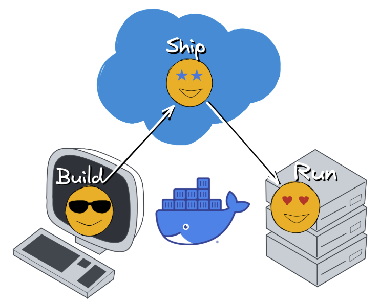
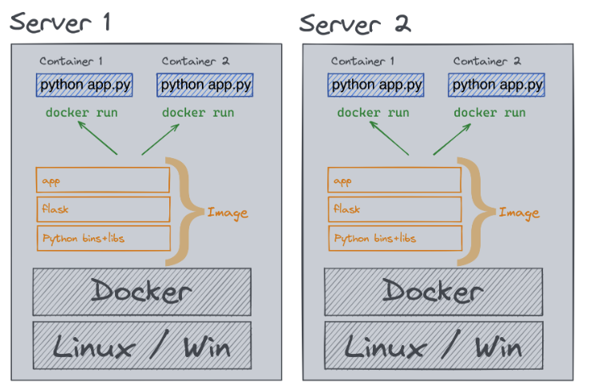

# Docker Quick Start Guide

## Prerequisites

- Docker installed and running (`docker version`)

## Basic Container Operations

### Running Apache HTTP Server

#### Command Syntax

`docker run -d -p <host_port>:<container_port> httpd`

#### Example Commands

When running an Apache container, Docker will:

1. Pull the httpd image (if not locally available)
2. Create a new container
3. Start Apache web server
4. Map specified ports
5. Run in background mode

- `docker run -d -p 8800:80 httpd`
- `docker run -d -p 8801:80 httpd`
- `curl localhost:8800`
- `docker ps`: Lists all running containers

#### Command Breakdown

| Component    | Description                                  |
| ------------ | -------------------------------------------- |
| `docker run` | Creates and starts a new container           |
| `-d`         | Runs container in detached mode (background) |
| `-p 8800:80` | Maps ports (host:container)                  |
| `httpd`      | Apache HTTP Server image                     |

